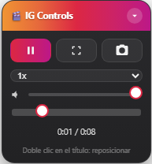

# Instagram Video Controls
**Última Actualización:** 14 de julio de 2026

Panel flotante con controles avanzados para videos y Reels de Instagram.

## 📖 Descripción

**Instagram Video Controls** es un UserScript para **Tampermonkey** que añade un panel flotante con controles adicionales para los videos y Reels de Instagram.

El panel permite controlar la reproducción sin depender de los controles originales de Instagram, además de añadir funciones que la plataforma no incluye de forma nativa.

---

# 📥 Instalación

1. Instala la extensión **Tampermonkey** para tu navegador.

2. Instala el script desde GitHub:

**➡️ [Instalar Script](https://github.com/wernser412/Instagram-Video-Controls/raw/refs/heads/main/Instagram%20Video%20Controls.user.js)**

---

# ✨ Características

- ▶️ Reproducir / Pausar video
- ⏩ Cambiar velocidad de reproducción
  - 0.1x - 0.25x - 0.5x - 0.75x - 1x - 1.25x - 1.5x - 2x - 3x
- 🔊 Control de volumen
- 📈 Barra de progreso
- ⏱ Mostrar tiempo actual y duración
- 🖥 Pantalla completa
- 📸 Descargar el fotograma actual como imagen PNG
- 🎯 Control automático del video visible
- 📦 Panel flotante arrastrable
- 📌 Posición del panel guardada automáticamente
- 📂 Estado colapsado/expandido persistente
- 💾 Volumen guardado entre sesiones
- ⌨️ Atajos de teclado
- 📱 Compatible con videos y Reels

---

# ⌨️ Atajos de teclado

| Tecla | Acción |
|--------|--------|
| Espacio | Reproducir / Pausar |
| F | Pantalla completa |
| ← | Retroceder 5 segundos |
| → | Avanzar 5 segundos |
| ↑ | Subir volumen |
| ↓ | Bajar volumen |

Los atajos se desactivan automáticamente cuando se está escribiendo en un cuadro de texto o comentario de Instagram.

---

# 🖥 Uso

Una vez instalado:

1. Abre Instagram.
2. Reproduce cualquier video o Reel.
3. El panel aparecerá automáticamente.
4. Arrástralo a la posición que prefieras.

---

# 💾 Configuración guardada

El script recuerda automáticamente:

- Posición del panel.
- Estado colapsado o expandido.
- Nivel de volumen.

No es necesario configurarlo cada vez que abras Instagram.

---

# 📄 Licencia

Este proyecto se distribuye bajo la licencia **MIT**.

Consulta el archivo **LICENSE** para más información.
